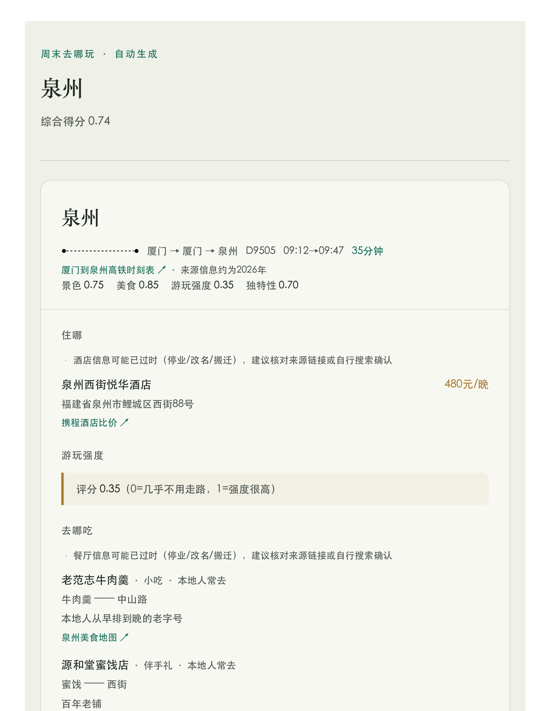

# 周末去哪玩 (Weekend Getaway)

[English](README.md) | **[中文](README.zh-CN.md)**


基于 LLM + 联网搜索的短途旅行规划器。输入出发城市、时间/预算约束和个性化权重
（更看重美食还是景色、能不能接受走路），自动生成候选目的地排名；对任意一个
候选目的地按需展开完整行程（车次、酒店、按天按小时的安排、本地人推荐的饭店、
以及"这趟到底值不值得去"的诚实判断），支持下载 HTML / PDF。

没有对接 12306/携程官方 API（都没有面向个人开发者的公开接口），事实类信息靠
模型的联网搜索工具调用获取，请以此为参考，出发前务必自行在 12306 / 携程上
复核车次和价格。

## 预览

<p align="center">
  
</p>

<p align="center"><em>生成的行程卡片示例（用占位数据演示排版效果，不是真实推荐）。</em></p>

## 快速开始

```bash
cd weekend-getaway
python3 -m venv .venv
source .venv/bin/activate
pip install -r requirements.txt

# 配置 API：见下面「配置 API」

streamlit run app.py
```

浏览器会自动打开 http://localhost:8501。

PDF 导出用的是 [WeasyPrint](https://weasyprint.org/)，依赖系统里的 pango/cairo：

```bash
brew install pango
```

（`pip install -r requirements.txt` 会装 Python 包，但 pango 这个系统库需要单独用 Homebrew 装一次；不装也不影响其他功能，只是下载 PDF 按钮会失败，可以退回下载 HTML。）

## 跑测试

```bash
pytest
```

39 个用例、不到1秒跑完，全部用假 LLM 客户端和假搜索结果离线跑，不消耗真实
API 额度。覆盖的都是实际踩过的坑（不是泛泛的"测一下能不能跑"）：JSON 自愈重试、
本地缓存命中/不命中和强制刷新、候选目的地并发核实+时长过滤+数量补位+去重、
酒店价格校验（含"预算数字被抄成价格"这个具体事故）、车次号溯源校验、跨城市
信息串味（长沙搜出天津饭馆）的过滤、搜索失败重试、HTML 渲染的来源标注和警示
样式、PDF 导出的中文字体乱码 bug。改代码之后跑一下这个，比每次现写一个一次性
脚本手动验证要可靠。

## 配置 API

支持两种方式，二选一，在页面左侧「模型设置」里切换：

**方式一：本地 `.env` 文件（推荐，避免每次手填）**

复制 `.env.example` 为 `.env`，填入你的 key：

```
LLM_API_KEY=你的key
LLM_BASE_URL=https://open.bigmodel.cn/api/paas/v4
LLM_MODEL=glm-4-air
```

`.env` 已经在 `.gitignore` 里，不会被提交到 git，请不要手动把它加进版本控制。

**方式二：在 Streamlit 页面里手动填写**

取消勾选"使用 .env 中的配置"，直接在页面上输入 API Key / Base URL / 模型名称。
这种方式填的 key 只存在当次浏览器会话的内存里，刷新页面就没了，不会写入任何文件。

当前默认接的是智谱 GLM-4（`https://open.bigmodel.cn/api/paas/v4`），但客户端走的是
标准 OpenAI 协议封装，理论上换成其他兼容 OpenAI 接口的模型（Moonshot、DeepSeek、
或者官方 OpenAI）只需要改 Base URL / Key / 模型名，不用改代码。

## 架构

```
用户偏好（出发城市/时间窗口/预算/权重）
   → candidate_gen   —— LLM 脑暴候选城市，逐个并发核实车程量级，四维度打分
                        （数量不够自动补位、按城市名去重、结果本地缓存）
   → scoring         —— 按用户权重线性加权排序（可解释，非黑箱）
   → [用户在候选列表里挑一个点"生成详细行程"，进度实时显示在 st.status 里]
   → itinerary_builder —— 酒店/去程车次/返程车次/"行程+餐厅"四路并发核实并校验，
                          每一项都会跟自己的搜索结果交叉核对再采信（结果本地缓存）
   → html_renderer / pdf_renderer —— 渲染成跟参考设计一致的页面，可在页面内预览、下载 HTML/PDF
```

```
weekend-getaway/
├── app.py                      # Streamlit 入口
├── pytest.ini                  # pytest 配置
├── .streamlit/config.toml      # 主题配色（跟详细行程页用同一套设计 token）
├── tests/                      # 假 LLM/假搜索离线跑，覆盖踩过的坑
└── weekendgo/
    ├── config.py                # LLM 设置 + 用户偏好数据结构
    ├── llm/client.py            # OpenAI 兼容协议客户端；chat_structured() 带
    │                             # JSON 自我修正重试
    ├── search/duckduckgo.py     # 免 API Key 的联网搜索工具，带失败重试退避
    ├── domain/models.py         # Pydantic 数据模型（车次/酒店/餐厅/行程/候选）
    ├── cache/store.py           # 基于本地文件的结果缓存（带 TTL + 强制刷新）
    ├── pipeline/
    │   ├── candidate_gen.py     # 候选目的地：脑暴 + 并发核实 + 数量补位 + 去重 + 缓存
    │   ├── scoring.py           # 按权重打分排序
    │   ├── itinerary_builder.py # 完整行程：并发搜索事实 + 结构化生成 + 缓存
    │   └── orchestrator.py      # get_candidates() / get_itinerary() 两段式入口
    └── render/
        ├── html_renderer.py     # 渲染成跟参考 PDF 一致的卡片式页面
        └── pdf_renderer.py      # HTML → PDF（weasyprint）
```

## 个性化权重说明

四个滑块，取值 0~1，互相独立：

- **景色权重**：越高越偏好有独特景观/人文的目的地
- **美食权重**：越高越偏好美食吸引力强的目的地
- **能接受走路/爬山的程度**：越低，排序时越偏好"游玩强度低"的目的地
  （比如避开需要爬很多台阶的景点）
- **独特性 / 时效性权重**：越高越偏好"出发城市体验不到的东西"——限时活动、
  独特节日、稀有地貌建筑等；如果一个地方只是"好吃但出发城市有平替"，
  这一项会被模型主动打低分

打分公式在 `weekendgo/pipeline/scoring.py` 里，是可解释的线性加权，不是黑箱模型。

## 候选目的地数量为什么会自动"补位"，又为什么不会重复

实测踩过的坑：用户选了"候选目的地数量=4"，最后页面上却只显示3个，而且不报错、
不提示，看起来像是丢数据的 bug。根因是有三个环节都可能悄悄让最终数量少于
用户要求的数量：脑暴模型没按要求的数量给够、某个候选城市名是空的被跳过、
核实出来车程明显超过时长上限被过滤掉但没有替补。

现在 `weekendgo/pipeline/candidate_gen.py` 改成了"能补位的循环"：脑暴+核实完
一轮后，如果数量还没凑够，就再脑暴一轮（明确排除已经试过的城市，不会重复），
补足差额，最多补 2 轮。正常情况下用户选几个就该看到几个；如果约束确实太严
（比如时长上限设得很短、出发城市附近本来就没那么多选择），两轮补位下来还是
凑不够，就如实展示已经核实过的候选（哪怕数量不够或车程超标），而不是死循环
硬凑、也不是安静地返回一个数量不对的列表让用户自己怀疑是不是哪里错了。

同时也真实踩过重复候选的坑（同一批脑暴结果里出现两个"广州"，甚至跨轮次出现
写法不同但核实后是同一个城市的"长沙"）。现在有一道不依赖猜测具体是哪个环节
漏洞的最终关卡：不管候选是从哪一轮、哪条路径产生的，只要核实完之后的城市名
已经被接受过，就不会重复收录。

## 酒店价格是怎么把关的

这是实测踩过的一个具体的坑：搜索引擎摘要经常根本不带酒店实时价格，但模型会
"看着差不多就编一个"，编出来的数字可能完全不在预算区间内、也完全没有依据；
甚至提示词里给的示例文案被模型照抄过一次，把用户设的预算下限直接当成"查到
的价格"展示出去过。现在的处理流程（`weekendgo/pipeline/itinerary_builder.py`）：

1. **酒店核实**（`_verify_hotel_primary`）和**经验兜底推荐**（`_recommend_fallback_hotel`）
   从一开始就并发调用，不是"核实失败了再补一次"——实测免费搜索对酒店价格的
   召回本来就弱，核实这条路径几乎总是会失败，与其失败了再串行等一轮，不如
   一开始就两条路一起跑，用多一次 API 调用换掉这一整轮等待时间（用户明确选择
   优先要速度，接受多花一点调用量）。
2. 核实成功、且代码校验（`_validate_hotel_price`，留了50%容差）确认价格没有
   明显偏离预算区间，就用核实到的结果。
3. 只要没能确认（模型主动承认没查到，或者被校验揪出来明显跟预算对不上），
   就用兜底推荐那条路径已经跑完的结果——**价格字段这时候固定写死"未查到价格"**，
   不管模型这次输出了什么都会被代码强制覆盖，绝不会再出现"编一个看似合理的
   数字"这种情况，哪怕是"预计XX元"这种带免责说明的估算也不允许。
4. 页面上"未核实"的价格会用橙色而不是金色展示，并带一个"未核实"小标签，
   一眼就能看出这个数字不能全信。

## 车次信息是怎么把关的

跟酒店同一个思路，但校验方式不一样——车次号是个具体的字符串（比如 G921），
可以直接检查它有没有在搜索结果原文里出现过：

1. 去程、返程车次各自单独调用一次（`_verify_train`），不跟酒店/餐厅/行程那个
   大调用打包在一起，提示词里把"没有具体车次号就必须留空，不能编"作为最高
   优先级规则。
2. 代码层面再兜底校验一次（`_validate_train_grounding`）：如果模型给的车次号
   压根没在搜索结果原文里出现过，大概率是编的——清空它，只保留大致时长
   （如果搜索结果里有的话），并在 note 里明确提醒"未能核实到这个车次号，
   请自行在12306查询实际车次"。
3. 酒店、去程车次、返程车次、"行程+餐厅"这四件事全部并发跑（`_build_itinerary_uncached`），
   互相独立，总耗时接近其中最慢的一个，不是四个耗时相加。

## 怎么防止跨城市信息串味

真报过的 bug：给"长沙"生成的行程，推荐的餐厅其实是在"天津"——免费搜索引擎
对中文出行类查询的召回质量本来就一般，偶尔会搜出跟目的地毫不相关的内容。
现在餐厅和酒店搜索都加了同一道过滤（`_filter_relevant_to_destination`）：

- 喂给模型之前，先过滤掉标题/摘要里完全没提到目的地城市名的搜索结果，
  不指望模型自己去分辨哪条是真的跟目的地有关。
- 如果餐厅搜索过滤完一条不剩，会换个说法再搜一次，减少"没有推荐"的情况，
  同时不引入串味风险。
- 两次搜索都过滤完一条不剩，就明确告诉模型如实说"未查到"，不要拿别的
  城市的信息凑数。

## 缓存和强制刷新是怎么回事

结果会缓存在本地（`.cache/`，24小时有效期，按请求参数算哈希做 key），同样的
规划请求短时间内重复请求不用再消耗一轮 API 调用和联网搜索。侧边栏和每张候选
卡片上都会提示"这组条件是否命中缓存、缓存有多新"，并且带一个"忽略缓存"勾选框
——比如怀疑缓存里的信息（比如某家酒店已经关门）已经过时，可以主动勾选强制
重新查询。

## 搜索的容错处理

免费的 DuckDuckGo 搜索接口（`ddgs`）比较容易触发限流，而这个 app 在短时间内
会并发打出去不少搜索请求（候选核实、酒店两个搜索词、去程/返程车次、餐厅）。
`search_web` 现在失败会先退避一下再重试，减少"明明查得到、只是刚好被限流"
却被误判成"这条信息真的不存在"的情况。

## 用起来是什么样

1. 左侧填偏好，点「开始规划」——只调用一次模型脑暴候选城市，
   再并发核实每个候选的车程，几秒到几十秒出候选排名（第二次同样的偏好会直接命中缓存，秒开）。
   等待的时候用 `st.status` 实时显示"核实「XX」完成"这种进度，不是一个不知道
   在做什么的转圈。
2. 候选目的地卡片式展示：城市、四维度评分、综合得分。想看哪个的详细行程，
   点它下面的「生成详细行程」——可以挨个点好几个候选对比着看，不是只能看排名第一的。
   这一步同样有实时进度（酒店/去程车次/返程车次/行程餐厅，哪个先完成先显示）。
3. 详细行程用跟参考 PDF 一致的卡片样式展示（住哪/怎么少走路/去哪吃/按天按小时的安排/
   值不值得去），页面内直接能看，也可以下载 HTML 或 PDF 发给别人。
4. 万一某一步失败了（网络问题、模型响应异常），页面上只会显示一句人话
   （"这次生成失败了，重新点一次通常就能恢复"），技术细节收进折叠框，不会把
   一坨原始报错甩到用户脸上，也不会让整个 app 崩掉。

## 已知限制（诚实说明，别被版本号误导）

- 没有对接 12306/携程官方 API，车次和价格都来自模型的联网搜索结果，
  可能不准确或过时，**出发前务必自己核实**。
- **模型选择很影响可用性，实测踩过坑**：`glm-4-flash` 虽然快，但会出现
  "看着调用了搜索、却没有根据搜索结果调整答案"的情况，容易输出编造的车程数字；
  换成 `glm-4-air` 之后这个问题基本消失，速度也还可以，所以设成了默认值。
  早期版本让模型自己决定"要不要再搜一次"（工具调用循环），强模型会陷入反复
  搜索、迟迟不收敛的问题——后来把这套机制整个删掉了，改成代码决定搜什么，
  模型只管基于结果生成结构化输出，不再有这个风险。
- 搜索用的是免 Key 的 DuckDuckGo（`ddgs`），对中文出行类查询的召回质量一般，
  比专门的地图 POI 接口（比如高德）差不少，酒店/餐厅的地址精度尤其受影响——
  这也是为什么酒店价格、车次号都做了"查不到就老实说、不能编"的强校验，
  餐厅/酒店搜索结果也做了目的地相关性过滤。
- 缓存是本地文件、24小时有效期，页面上有按请求维度的"忽略缓存"勾选框；
  想一次性清空可以调用 `weekendgo.cache.store.clear_all()` 或者直接删掉
  项目根目录下的 `.cache/`。
- 进度提示是"哪个子任务先完成就先显示哪个"，不是真正意义上的百分比进度条；
  单个候选目的地生成详细行程一般在几十秒量级，取决于模型响应速度和网络状况。

## 安全提醒

- 千万不要把 `.env` 加入 git 提交，也不要把 API Key 直接写进任何会被提交的代码文件里。
  `.env` 已经在 `.gitignore` 里。
- 手动填写的 API Key（方式二）只存在当次浏览器会话的内存里，不会写入磁盘、
  也不会被打印或记录。
- 本项目定位是本地运行。没有做鉴权、没有限流、也没有针对多租户/公网部署做过
  输入安全加固——不要不加防护地直接把它暴露到公网上。

## License

保留所有权利，详见 [LICENSE](LICENSE)。本仓库公开仅用于作品展示，不是开源
项目，未经许可不得复制、修改或再分发其中的代码。
